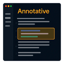

# Annotative

Annotative is a lightweight VS Code extension that lets you annotate code directly in your editor—perfect for reviewing AI-generated suggestions, collaborating on code reviews, and capturing insights on the fly. Highlight code, add tagged notes with custom colors, and export to Markdown for sharing with your team or discussing with AI tools like Copilot, ChatGPT, and Claude.

## Why Annotative?

- Review AI-generated code - Flag issues in Copilot, ChatGPT, or Claude suggestions
- Collaborative code reviews - Leave feedback that's easy to share and discuss
- Documentation on the fly - Capture insights while coding
- Self-review before commits - Catch issues during your own quality checks
- Team knowledge sharing - Export annotations for team discussions and AI chats
- Learning tool - Annotate code systematically as you study new concepts

## How It Works

1. Select code you want to annotate
2. Press Ctrl+Shift+A or right-click and select "Add Annotation"
3. Enter your note
4. Add tags to categorize (bug, performance, security, etc.)
5. Choose a color for visual preference
6. View in sidebar with flexible organization options
7. Export as Markdown or share with your team

## Core Features

- **Quick & Simple** - Keyboard shortcuts and context menus for fast annotation
- **8 Color Options** - Choose colors based on personal preference
- **Flexible Tagging** - Categorize annotations: bug, performance, security, style, improvement, docs, question, ai-review
- **Visual Highlighting** - Annotated code is highlighted directly in your editor
- **Smart Organization** - View annotations organized by file, tag, or status
- **Resolution Tracking** - Mark annotations as resolved when issues are fixed
- **Easy Export** - Generate Markdown for AI chats, team discussions, or documentation
- **Persistent Storage** - Annotations auto-save and restore between sessions
- **Zero Config** - Works out of the box, no setup required

## Advanced Features

- **Multiple Organization Modes** - Group annotations by file, semantic tags, or resolution status
- **Bulk Operations** - Select multiple annotations and tag, resolve, delete, or change color in batch
- **Filter by Status** - Show all, unresolved only, or resolved only annotations
- **Filter by Tag** - Filter annotations by specific tags to focus on what matters
- **Search Annotations** - Find annotations across your workspace
- **Edit Annotations** - Modify comments, tags, and colors after creation
- **Keyboard Navigation** - Jump to next/previous annotation with Alt+Up/Down
- **Undo Support** - Quickly undo the last annotation with Ctrl+Shift+Z
- **Copilot Integration** - Direct integration with GitHub Copilot Chat (@annotative participant)
- **Multi-Format Export** - Optimized exports for Copilot, ChatGPT, Claude, or generic AI tools
- **Template Support** - Quick templates for common annotation scenarios

## Keyboard Shortcuts

| Shortcut                            | Action                          |
| ----------------------------------- | ------------------------------- |
| `Ctrl+Shift+A` (Mac: `Cmd+Shift+A`) | Add annotation to selected text |
| `Ctrl+Shift+Z` (Mac: `Cmd+Shift+Z`) | Undo last annotation            |
| `Alt+Down`                          | Go to next annotation           |
| `Alt+Up`                            | Go to previous annotation       |
| `Ctrl+Shift+F` (Mac: `Cmd+Shift+F`) | Search annotations              |
| `Ctrl+Alt+E` (Mac: `Cmd+Alt+E`)     | Export by intent                |

## AI Integration

Export your annotations and paste directly into ChatGPT, Copilot Chat, or Claude to:

- Discuss issues and get suggestions
- Request code improvements
- Generate documentation
- Iterate on AI-generated code

### GitHub Copilot Integration

Use the `@annotative` participant in Copilot Chat to:

- Get AI suggestions on all annotations in a file
- Ask Copilot about specific annotations
- Generate fixes for flagged issues

## Installation

1. Open VS Code
2. Go to Extensions (`Ctrl+Shift+X` / `Cmd+Shift+X`)
3. Search for "Annotative"
4. Click Install

## Getting Started

After installation:

1. Select any code in your editor
2. Press `Ctrl+Shift+A` or right-click and select "Add Annotation"
3. Enter your note and choose a color
4. (Optional) Add tags to categorize the annotation
5. View all annotations in the Annotative sidebar
6. Export annotations to share

## Requirements

- VS Code 1.105.0 or higher
- No additional dependencies - works out of the box!

## Development & Contributing

Want to contribute or test locally?

**Quick Start:**

1. Clone the repository
2. Run `npm install`
3. Press **F5** in VS Code to launch the extension
4. Test in the Extension Development Host window

See [CONTRIBUTING.md](CONTRIBUTING.md) for detailed setup instructions.

## Workspace Storage

Annotations are stored per workspace in `.annotative/annotations.json`:

- **Workspace-specific**: Each workspace has its own annotations
- **Auto-save**: Changes save automatically
- **Portable**: Take your workspace and annotations with you

## Tips & Best Practices

### For Code Reviews

1. Use red for bugs and critical issues
2. Use orange for warnings and potential problems
3. Use blue for documentation needs
4. Export and share with team

### For AI-Generated Code Review

1. Tag annotations with "ai-review"
2. Use red for issues, green for optimizations
3. Export and ask Copilot/ChatGPT for fixes

### For Team Collaboration

1. Establish consistent tags across your team
2. Use colors strategically based on team conventions
3. Export annotations for discussions and knowledge sharing

### For Organizing Many Annotations

1. Use "Group by Tag" to see all similar issues together
2. Use "Group by Status" to separate open vs resolved
3. Use bulk tagging to categorize groups of annotations at once
4. Use bulk actions to efficiently manage large annotation sets

## License

Annotative is fully open source and available under the MIT License.

- Free for personal, educational, commercial, and enterprise use
- Modify and distribute freely
- No restrictions on commercial use

See [LICENSE](LICENSE) for details.

## Recent Updates

### Version 1.2.6 (Current) - Latest Stable Release

- Icon and UI refinements
- Bug fixes and stability improvements

### Version 1.2.0 - Simplified UI & Color Customization

- 8-color picker for visual annotation preference
- Replaced complex webview with lightweight input boxes
- Native VS Code UI components for better performance
- Full MIT open source license

### Version 1.1.0 - Enhanced User Experience

- Filtering system (status, tags, search)
- Editing capabilities for annotations
- Bulk operations (resolve all, delete resolved)
- Keyboard navigation (Alt+Up/Down)
- Improved sidebar organization

See [CHANGELOG.md](CHANGELOG.md) for complete version history.

## Support

- Issues: Report bugs on GitHub
- Discussions: Join GitHub Discussions
- Features: Suggest features on GitHub

Made for developers who care about code quality.
