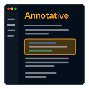

# Annotative

Annotative is a VS Code extension for reviewing code in place. Add annotations to selections, organize them with custom tags, keep them in project storage, and export them for documentation or AI-assisted review.

## Current Release

Annotative is currently prepared for `v3.0.2`.

`v3.0.2` keeps the project-based storage model introduced in `v2`, and continues the recent work on stability, anchored annotations, export cleanup, release hygiene, and Marketplace positioning.

Upgrade notes are in [MIGRATION.md](MIGRATION.md).

## What It Does

- Add annotations to code selections from the keyboard or context menu
- Group and filter annotations in the sidebar webview
- Manage project-specific custom tags
- Export annotations to clipboard, a document, or AI-oriented formats
- Save shared annotation data in `.annotative/`
- Integrate with GitHub Copilot Chat through `@annotative`

## Quick Start

1. Open a folder or workspace in VS Code.
2. Select code.
3. Run `Annotative: Add Annotation` or press `Ctrl+Shift+A` on Windows/Linux or `Cmd+Shift+A` on macOS.
4. Enter a comment, then optionally choose tags and a highlight color.
5. Open the `Annotations` view in the activity bar to review, filter, and export annotations.

## Storage Model

Annotative stores project data in `.annotative/` at the workspace root.

- `annotations.json` stores annotations
- `customTags.json` stores custom tag definitions
- `README.md` explains how to include or ignore the folder in version control

Storage is created automatically on first save, or explicitly with `Annotative: Initialize Storage`.

## Key Capabilities

### Annotation workflow

- Add, edit, remove, and toggle annotation status
- Undo the most recent annotation
- Navigate to previous and next annotations in the active file
- Keep inline decorations synchronized with saved annotations

### Sidebar workflow

- Group by file, folder, tag, or status
- Filter by status and tag
- Search within the current annotation set
- Run bulk actions such as `Resolve All`, `Delete Resolved`, and `Delete All`

### Tag workflow

- Create user-defined tags with category, priority, and color
- Edit or delete existing tags
- Share tag definitions through `.annotative/customTags.json`

### Export workflow

- Export Markdown to the clipboard
- Open an export in a new untitled document
- Export for Copilot, ChatGPT, Claude, or a generic AI target
- Export by intent for review, bugs, optimization, or documentation
- Save Copilot-oriented exports under `.copilot/annotations`

## Copilot Integration

When GitHub Copilot Chat is installed and `annotative.copilot.enabled` is enabled, Annotative registers an `@annotative` chat participant.

Supported commands:

- `/issues`
- `/explain`
- `/fix`
- `/review`

Annotative can also prepare AI-specific exports and optionally open the Copilot Chat panel after export.

## Commands

Key command groups:

- Annotation: `Add Annotation`, `Add from Template`, `Edit`, `Toggle Status`, `Remove`, `Undo`, `View Details`
- Navigation: `Next`, `Previous`, `Go to Location`
- Filters: `Filter by Status`, `Filter by Tag`, `Search`, `Clear Filters`, `Refresh`
- Bulk: `Resolve All`, `Delete Resolved`, `Delete All`
- Tags: `Create Tag`, `Edit Tag`, `Delete Tag`, `List Tags`
- Export: `Export to Clipboard`, `Export to Document`, `Export by Intent`, `Export for AI`, `Batch AI Review`
- Storage: `Initialize Storage`, `Storage Info`

## Keyboard Shortcuts

| Shortcut                       | Action           |
| ------------------------------ | ---------------- |
| `Ctrl+Shift+A` / `Cmd+Shift+A` | Add Annotation   |
| `Ctrl+Shift+Z` / `Cmd+Shift+Z` | Undo             |
| `Alt+Down`                     | Next             |
| `Alt+Up`                       | Previous         |
| `Ctrl+Alt+E` / `Cmd+Alt+E`     | Export by Intent |

## Configuration

Annotative currently exposes these settings:

- `annotative.export.contextLines`
- `annotative.export.includeImports`
- `annotative.copilot.enabled`
- `annotative.copilot.autoAttachContext`
- `annotative.copilot.preferredFormat`
- `annotative.copilot.autoOpenChat`

## Requirements

- VS Code `1.105.0` or later
- A folder or workspace for project storage features
- GitHub Copilot Chat only if you want Copilot-specific commands or exports

## Upgrade Notes

- Upgrading from `v2.x` to `v3.0.2`: no manual storage migration is required.
- Upgrading from `v1.5.x` or earlier: legacy global-state data is not imported automatically.

See [MIGRATION.md](MIGRATION.md) for the full upgrade path.

## Development

Development setup, testing, and contribution guidance are in [CONTRIBUTING.md](CONTRIBUTING.md).

## License

MIT. See [LICENSE](LICENSE).
